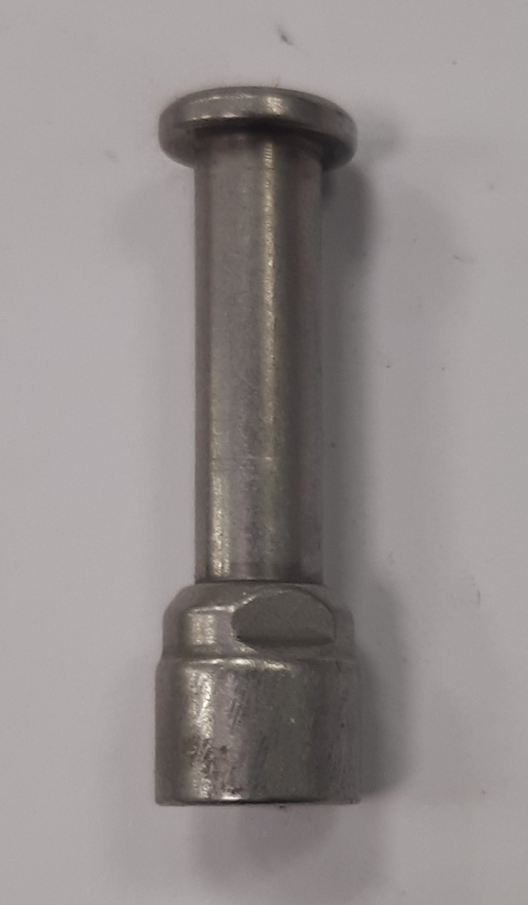
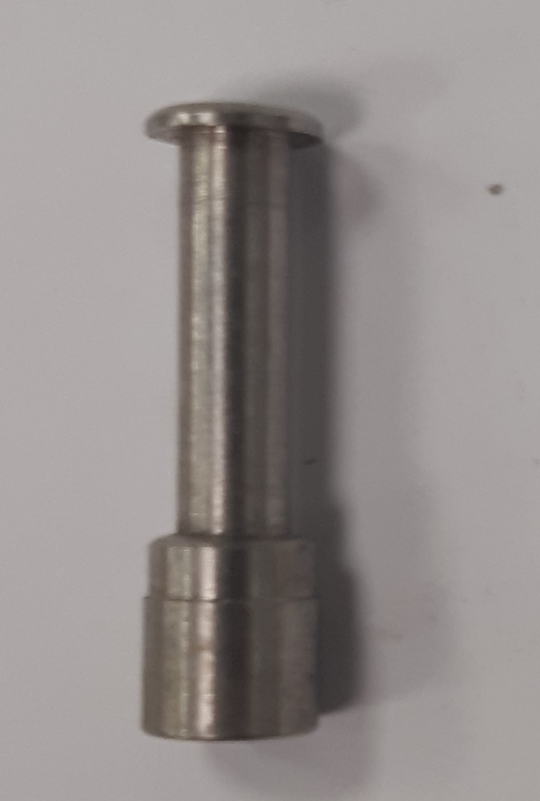

# Diferenciación de printcore 0.4 original y alternativo en UM3

 _Principales diferencias entre los printcores alternativos y originales de 0.4 mm que se encuentran en el Fablab._
 

_Tras múltiples pruebas con los printcores de 0.4 mm, tanto originales como alternativos, estos fueron desarmados y debido a que muchos de sus componentes no son compatibles por lo que es necesario identificar las partes de cada uno._

## Carcasa 

_Debido a que las diferencias de dimensiones de las carcasas son pequeñas y que la textura del material dependerá del uso, la manera más sencilla de diferenciar la original de la alternativa es fijarse en el carácter que separa las cifras decimales del 0.4. En al caso del original, el carácter que separa los números 0 y 4 es un círculo como se ve en las carcasas que están a la izquierda de la imagen. En el caso de las alternativas el carácter que separa los números es un cuadrado como se ve en la carcaza en la derecha de la imagen._

## Disipadores 

_La principal diferencia entre el disipador original y el alternativo es que el original posee una guía de teflón en su interior y la punta en la que se enrosca el nozzle se conecta a presión con el disipador (disipador de la izquierda de la imagen), en cambio, el alternativo no posee guía de teflón y la punta donde se enrosca el nozzle también se enrosca en el disipador (disipador de la derecha de la imagen)._

## Guía de entrada del disipador 

_La principal diferencia entre una guía original y una alternativa es que la original presenta dos cortes en forma de media luna (como se ve en la imagen de la izquierda), los cuales sirven para sacar la guía con un llave, en cambio en el caso del alternativo los cortes son rectos(imagen de la derecha)._

 
